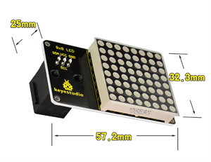
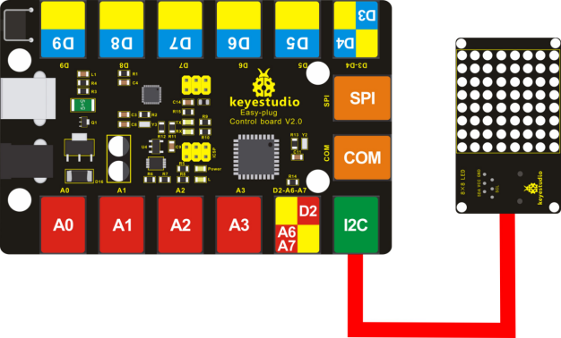
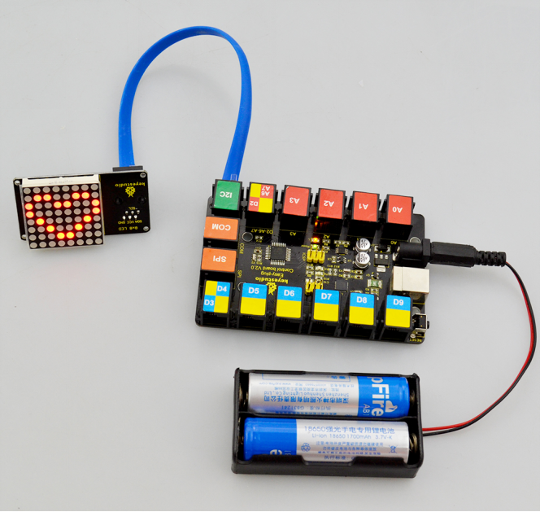
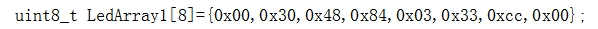

# KS0380 EASY plug 8x8 LED Matrix Module -180° Interface


## 1. Introduction

What's better than a single LED? Lots of LEDs! A fun way to make a small display is to use an 8x8 matrix.

This module uses HT16K33 chip to drive an 8x8 dot matrix.

Just need to use the I2C communication port of microcontroller to control the dot matrix, which can save more port resources of microcontroller.

The four pin of this module is integrated into a crystal plug, with direction 180°.

All you need to do is connecting the module to control board for communication using an RJ11 cable. The module’s default I2C communication address is 0x70.

**Special Note:**

The sensor/module is equipped with the RJ11 6P6C interface, compatible with our keyestudio EASY plug Control Board with RJ11 6P6C interface.

If you have the control board of other brands, it is also equipped with the RJ11 6P6C interface but has different internal line sequence, can’t be used compatibly with our sensor/module.

## 2. Technical Details

- Interface: Easy plug
- Operating voltage: DC 4.5V-5.5V
- I2C communication address: 0x70
- Dimensions：57.2mm * 32.3mm * 25mm
- Weight：15.1g



## 3. Hookup Guide



## 4. Test Code

Download code :  [Resources](./Resources.7z)

Note： before uploading the code, you need to import the library files; otherwise, the code upload will fail.

```c
#include <Matrix.h>
Matrix myMatrix(A4,A5);
uint8_t LedArray1[8]={0x00,0x30,0x48,0x84,0x03,0x33,0xcc,0x00};
uint8_t  LEDArray[8];

void setup()
{
	myMatrix.begin(0x70);
}

void loop()
{
  myMatrix.clear();
  for(int i=0; i<8; i++)
  {
    LEDArray[i]=LedArray1[i];
    for(int j=7; j>=0; j--)
    {
      if((LEDArray[i]&0x01)>0)
      myMatrix.drawPixel(j, i,1);
      LEDArray[i] = LEDArray[i]>>1;
    }
  }
  myMatrix.writeDisplay();
}
```

## 5. Test Result

Done uploading the code to the board, power on, you should see the 8*8 matrix displaying a heart image. Shown below.



## 6. Settings Method

You can set the display image in the code shown below. 



Place the matrix module as follows: 


Then convert 0x00,0x30,0x48,0x84,0x03,0x33,0xcc,0x00 into Binary number:

- 0x00 should be 0 0 0 0 0 0 0 0
- 0x30 should be 0 0 1 1 0 0 0 0
- 0x48 should be 0 1 0 0 1 0 0 0
- 0x84 should be 1 0 0 0 0 1 0 0
- 0x03 should be 0 0 0 0 0 0 1 1
- 0x33 should be 0 0 1 1 0 0 1 1
- 0xcc should be 1 1 0 0 1 1 0 0
- 0x00 should be 0 0 0 0 0 0 0 0

The first hexadecimal number represents the control of the first column of LEDs. The second data represents the control of the second column of LEDs. And so on.

- The settings is converting Hexadecimal data into binary data 8-bit.
- The number 0 means LED off, and number 1 means LED on.
- The first converted number is controlling the second row of LED on and off.
- The seventh number is controlling the eighth row of LED on and off.
- The eighth number is controlling the first row of LED on and off. And so on.